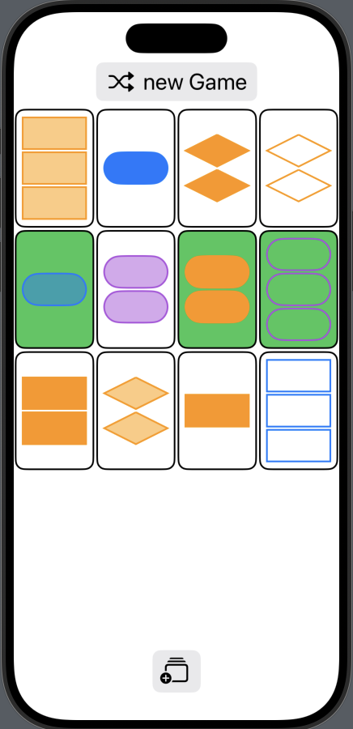

# Set

Set is a small iOS game I created for the course cs193p. The goal is to find valid sets consisting of three cards.

## Screenshots



## Installation
    
1.    Clone the repository:
```bash
git clone https://github.com/leonyannick/cs193p-Memorize.git
```
2.    Open the project in Xcode.
3.    Run on an iOS Simulator or a physical device.

## How to Play

1.    Tap on a card to select it.
2.    Select three cards that you think are a matching set.
3.    Each card has four unique features with three different possibilities for each feature: shape, color, filling, and amount of shapes. A card is contained in a valid set when each of its features is either completely distinct or identical in respect to the other two cards.
4.    Click on the "more Cards" button to receive more cards from the pile.
5.    The game is won when all the sets are found and no more cards are left.
6.    Click the “New Game” button to shuffle and start a new game!
